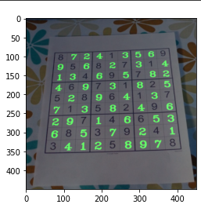

# sudoku-solver with openCV

 
This is a sudoku solver application which take images as inputs and print answers on given image. This project is done using Google colab so if you run this programme you have to use Jupyter notebook or google colab. The code is commented and separated into sections so that it is easy to understand.
